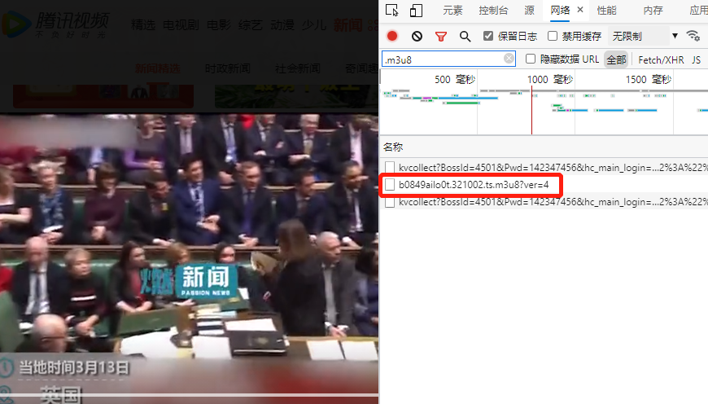

# WHY repeat build the wheel
Its practical ffmpeg can be downloaded directly according to the m3u8 file, but some m3u8 files do not have the complete url 😑. If you want to download with ffmpeg at this time, it will be more troublesome. You need to manually edit the m3u8 file to fill in the urls of all fragments. This is ten thousand. Unacceptable, trouble! ! !

# for chinese doc

# prerequisite
## have installed nodejs
## have installed ffmpeg and add ffmpeg executor to the system path

# advantage
It only relies on nodejs at runtime, without any third-party libraries, and no node_modules black hole😃

# 用法
find your m3u8 file in browser,as follow:

save the file and give it a simple name such as：111<br>
import index.js file，then build a client instance，call `download` to begin download
there will be a mp4 file when download successfully<br>
The constructor currently receives five parameters, the specific definitions are as follows:
+ file：the name of the m3u8 file to be downloaded , you only need to pass in the name, no extension is required, such as 111.m3u8 directly pass 111.
+ prefix：Some m3u8 file urls only have the ts file name without the prefix url. This parameter is used to set the prefix url. If the m3u8 contains a complete url, pass an empty string '' instead of null
+ hasParam：the url in some m3u8 files contains parameters. Setting these parameters to true can parse the ts fragment file name correctly
+ deleteTemFile：whether delete the cache file when download completely
+ output：the final output mp4 file name, such as save as 222.mp4, just input 222

take tencent video as an example:
```
let client = new download('222',
  'https://apd-efe7721cc90c5d225f6c5248371a6c58.v.smtcdns.com/omts.tc.qq.com/AOuvIp8ucBrJsCNI07u9ClgmEZFAKjLICgUl8_cp9ORs/uwMROfz2r5zIIaQXGdGnC2df645AHpR-pVjI5hvW8Wk822MC/dT_ZjXy6-zkrzNHhNoHTTiUE3UIfML_SsEA37_lIo9itKxb5M4YMJ8uYZ4Yk2W8u2tp0ec1FIxdhJ2Zk-dPGNXp15g-D17kXWuSWfSO-2cXM5dsBuPKTdQH9ckEuNIfW67e3EkUfHj1eNu36veLHP75MD4spo2l8lNkwhZhKOCpS9aqJrsVmEw/',
  true,
  false);
```
take youku video as an example:<br>
`let client2 = new download('111', '', true, false);`

# Disclaimer
This code is only used for testing and sharing. Users should pay attention to the copyright issues of the video provider. If the use of this library for illegal operations infringes the rights of others, the user is fully responsible, and I am not responsible.