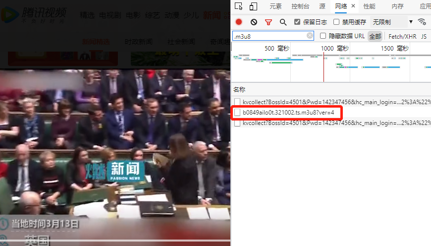

# 前提条件
## 已安装nodejs
## 已安装ffmpeg并正确配置环境变量

# 用法
先在浏览器中找到m3u8文件url，如下图

右键在新窗口中打开，浏览器会自动下载该文件，将该文件修改为一个简单的名字如：111<br>
引入index文件，构造客户端实例，调用`download`下载即可，下载成功后，当前文件夹下会有参数指定的mp4文件<br>
构造函数目前接收五个参数，具体释义如下：
+ file：要下载的m3u8文件名称，只需要传入名称，无需扩展名，如111.m3u8直接传111即可
+ prefix：有的m3u8文件url中只有ts文件名称（如某1），没有前缀url，此参数用于设置前缀url，若m3u8中包含完整的url，传递空字符串''
+ hasParam：有的m3u8文件中的url包含参数（如某酷），将些参数设置为true，可以正确解析ts片断文件名
+ deleteTemFile：文件下载成功后，是否删除中间文件
+ output：最终输出的mp4文件名，如保存为222.mp4，传入222即可

以某迅视频为例
```
let client = new download('222',
  'https://apd-efe7721cc90c5d225f6c5248371a6c58.v.smtcdns.com/omts.tc.qq.com/AOuvIp8ucBrJsCNI07u9ClgmEZFAKjLICgUl8_cp9ORs/uwMROfz2r5zIIaQXGdGnC2df645AHpR-pVjI5hvW8Wk822MC/dT_ZjXy6-zkrzNHhNoHTTiUE3UIfML_SsEA37_lIo9itKxb5M4YMJ8uYZ4Yk2W8u2tp0ec1FIxdhJ2Zk-dPGNXp15g-D17kXWuSWfSO-2cXM5dsBuPKTdQH9ckEuNIfW67e3EkUfHj1eNu36veLHP75MD4spo2l8lNkwhZhKOCpS9aqJrsVmEw/',
  true,
  false);
```
以某酷为例<br>
`let client2 = new download('111', '', true, false);`

# 免责声明
此代码仅用于测试和分享，使用者请注意视频提供者版权问题，若使用此library进行非法操作侵犯他人权益，则使用者就负全部责任，本人不负任何责任
